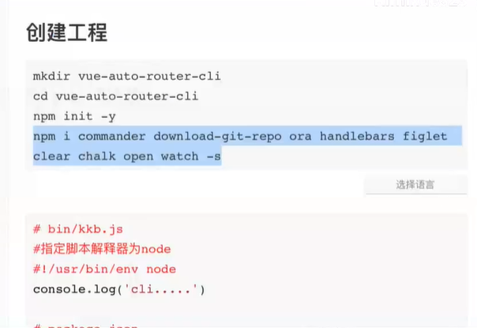

## 学习笔记

- 安装依赖：

```bash
$ yarn add commander download-git-repo ora handlebars figlet clear chalk open watch -D
```



- 新建 bin/demo.js 

```js
#!/usr/bin/env node
'use strict';


const program = require('commander')
program.version(require('../package.json').version)

program
  .command("init <name>")
  .description("init project")
  .action((name) => {
    console.log('init ' + name)
  })


program.parse(process.argv)
```

- 编辑 `package.json`

```json
"bin": {
    "demo": "./bin/demo"
  },
```

- 链接：进入 bin 目录，执行 `npm link`

测试：


参考资料：

- [从0到1用Node完成一个CLI工具](https://www.bilibili.com/video/BV1QK4y1t7w5?t=2628)
- [开课吧夏老师-cli代码资料](https://github.com/su37josephxia/kaikeba-cli/blob/master/bin/miku.js)